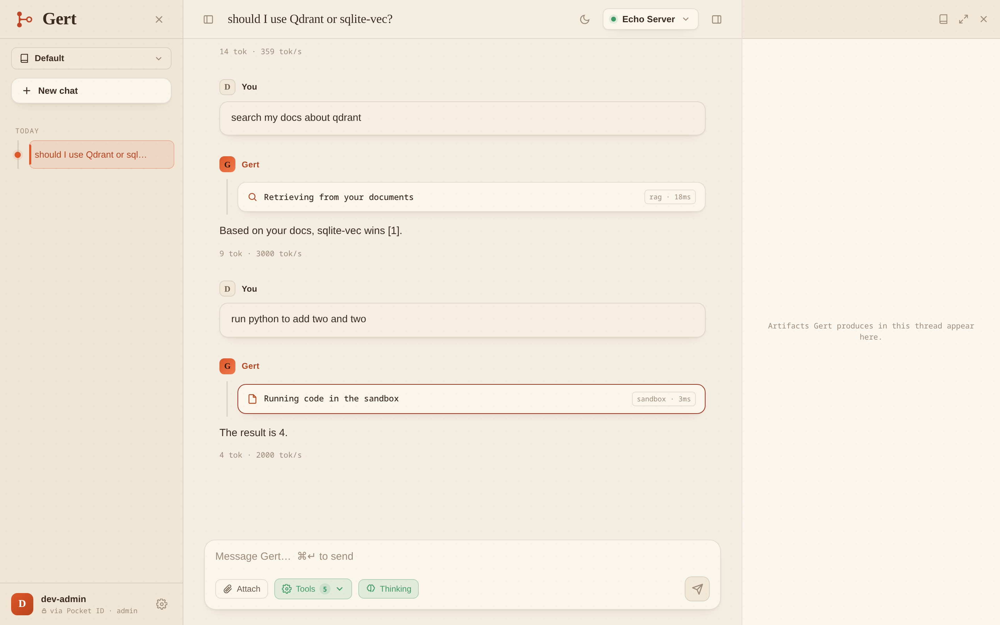

<p align="center">
  
</p>

<h1 align="center">Gert</h1>

<p align="center">
  <strong>Your AI chat. Your hardware. Your data.</strong><br>
  A privacy-first, self-hosted LLM chat server with hybrid RAG, sandboxed code execution,
  and web search.
</p>

<p align="center">
  <a href="https://rijos.github.io/gert/">Website</a> -
  <a href="https://rijos.github.io/gert/docs/">Documentation</a> -
  <a href="docs/design/">Design docs</a>
</p>

<picture>
  <source media="(prefers-color-scheme: dark)" srcset="site/assets/chat-dark.png">
  
</picture>

> [!NOTE]
> **This entire project** is almost entirely AI made, learning how I can intergrate AI in my daily work.
> **WARNING** I keep disagreeing with the "Global" structure and choices AI makes, consider this project still in the 'scaffolding' phase while I restructure.

## Features

- **Hybrid RAG** - upload PDFs, DOCX, markdown; vector KNN (`sqlite-vec`) + BM25 (`FTS5`)
  fused with Reciprocal Rank Fusion, with citations back to file and page.
- **Sandboxed Python** - the model runs code in an ephemeral [gVisor](https://gvisor.dev)
  container: no egress, read-only rootfs, CPU/memory/PID caps. Only stdout comes back.
- **Web search** - self-hosted [SearXNG](https://docs.searxng.org), with an SSRF-hardened
  optional fetch-and-summarize step.
- **Artifacts canvas** - named code fences open as live canvas tabs (HTML preview, source
  view, download) and persist across reloads.
- **Projects** - isolated workspaces, each with its own chats and documents; custom
  project instructions ride the system prompt, uploaded documents are retrieved on demand.
- **Detached turns** - generation runs on a background worker and survives client
  disconnects; resume over SSE or polling from an exact event cursor.
- **Passkey login** - OIDC Authorization Code + PKCE against an OAuth Compatible provider;  
  RS256-pinned JWT validation, token in memory only.
- **No npm, no CDN** - the SPA is [VanJS](https://vanjs.org) with vendored libs, served by
  the API itself on one origin: strict CSP, no CORS, no build step.

## Quick start

Prerequisites: the **.NET 10 SDK** and an **OpenAI-compatible model server** (e.g.
[vLLM](https://docs.vllm.ai)) serving a chat model and an embedding model, plus an OIDC
provider. SearXNG and gVisor are optional.

```bash
git clone https://github.com/rijos/gert
cd gert
dotnet build Gert.sln -c Release
```

Point `src/Gert.Api/appsettings.json` at your model server and IdP:

```jsonc
{
  "Gert": {
    "Chat": {
      "DefaultProvider": "qwen36",
      "Providers": {
        "qwen36": {
          "Name": "Qwen 3.6",
          "Type": "openai",
          "Capabilities": [ "tools", "vision" ],
          "Parameters": {
            "BaseUrl": "http://openaicompatible:8000", // NO trailing /v1
            "Model": "qwen36"
          }
        }
      }
    },
    "Embeddings": {
      "Type": "OpenAI",
      "Parameters": {
        "BaseUrl": "http://openaicompatible:8000",   // NO trailing /v1
        "Model": "bge-m3"
      }
    },
    "Tools": {
      "Search": { "Parameters": { "BaseUrl": "http://localhost:8080" } } // SearXNG compatible instance
    }
  },
  "Auth": { "Authority": "https://id.example.com", "Audience": "gert-api" },
  "Storage": { "DataRoot": "/data", "ExpectedIssuer": "https://id.example.com" }
}
```

```bash
dotnet run --project src/Gert.Api -c Release
```

Folders, settings, and a default project are provisioned lazily on first login - a valid
token is sufficient to exist. See the
[quick start](https://rijos.github.io/gert/docs/quick-start.html) and
[configuration reference](https://rijos.github.io/gert/docs/configuration.html) for every
knob.

### Try it with zero infrastructure

The repo ships a fully mocked world (auth, model, search) - click through the real UI with
nothing but [uv](https://docs.astral.sh/uv/) installed:

```bash
make serve-mock                                      # mocked everything, prints a signed-in URL
```

## Development

```bash
make test       # full .NET test suite
make build      # build (warnings are errors)
make e2e        # Python + Playwright browser matrix
make coverage   # tests + HTML coverage report
```